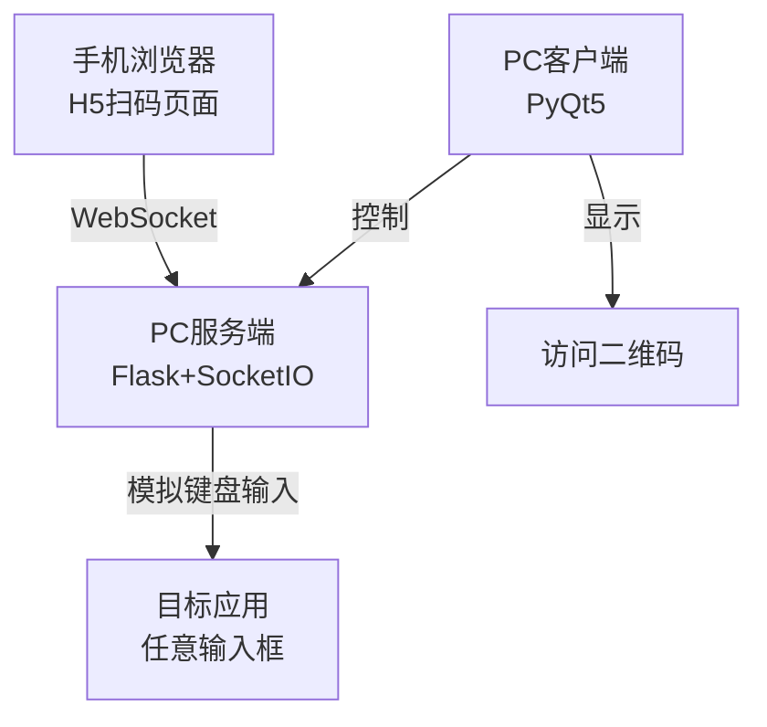

# H5 扫码枪 - Python 版本 v1.0.0

<p align="center">
  
</p>

<p align="center">
  <strong>📱 手机变扫码枪 | ⚡ 毫秒级响应 | ⌨️ 自动输入</strong>
</p>

## 项目简介

H5扫码枪是一个轻量级的扫码解决方案，通过H5页面调用手机摄像头，利用WebSocket实现扫码结果的实时传输到PC端并自动模拟键盘输入，将手机变成无线扫码枪。

## 核心功能

| 功能 | 描述 |
|------|------|
| 📱 **H5扫码** | 纯网页扫码，无需安装App |
| ⚡ **毫秒级延迟** | WebSocket实时传输，响应迅速 |
| ⌨️ **自动输入** | PC端模拟键盘，扫码后自动输入 |
| 🔒 **单实例运行** | 自动检测，避免重复启动 |
| 📷 **二维码生成** | 自动生成访问二维码，扫码即用 |
| ⚙️ **频率控制** | 4档识别频率，防重复扫描 |
| 🎯 **跨平台** | 支持Windows、macOS、Linux、iOS、Android |
| 🚀 **一键启动** | 图形界面，一键控制 |

## 系统架构



### 数据流

1. **扫码阶段**：手机摄像头捕获条码 → html5-qrcode解码
2. **传输阶段**：通过WebSocket实时发送到PC服务端
3. **输入阶段**：PC端接收数据 → PyAutoGUI模拟键盘输入 → 自动填入当前光标位置

## 项目结构

```
h5-barcode-gun-python/
├── ╭── 页面模板 (templates/)
│   │   └── scanner.html┃    扫码页面
│   │
├── ╭── 静态资源 (static/)
│   │   ├─ scan_icon.png┃      应用图标
│   │   ├─ html5-qrcode.min.js┃ 扫码库
│   │   └─ socket.io.min.js┃   WebSocket客户端
│   │
├── ╭── 核心服务 (utils/)
│   │   └── dual_server.py           # 双端口服务(HTTP+WebSocket)
│   │   └── cert_utils.py            # SSL证书工具
│   │   └── keyboard_simulator.py    # 键盘模拟输入
│   │
├── pc_client_windows.py     # Windows PC客户端(PyQt5)
└── requirements.txt         # 依赖包列表
```

## 使用条件

| 类别 | 要求 |
|------|------|
| 🐍 Python | 3.8或更高版本 |
| 💻 PC端 | Windows 10/11（客户端）<br>macOS/Linux（服务端） |
| 📱 手机端 | iOS/Android浏览器 |
| 🌐 网络 | **同一WiFi网络** &nbsp; ⚠️必需 |
| 🔐 权限 | 需要管理员权限运行

## 快速开始

### 1. 安装依赖

```bash
cd D:\PythonWork\h5-barcode-gun-python
pip install -r requirements.txt
```
<details>
<summary>点击展开完整依赖列表</summary>

| 依赖库 | 版本 | 作用 |
|--------|------|------|
| Flask | ≥2.0.0 | Web框架 |
| Flask-SocketIO | ≥5.0.0 | WebSocket支持 |
| PyQt5 | ≥5.15.0 | Windows GUI |
| PyAutoGUI | ≥0.9.52 | 键盘模拟 |
| pynput | ≥1.7.3 | 键盘监听 |
| qrcode | ≥7.3.1 | 二维码生成 |
| Pillow | ≥8.0.0 | 图像处理 |
| pyinstaller | ≥6.3.0 | 打包工具 |

</details>

### 2. 启动PC客户端（推荐）

双击运行或命令行启动：

```bash
python pc_client_windows.py
```

#### PC客户端功能

| 功能 | 说明 |
|------|------|
| 🔘 **服务器控制** | 一键启动/停止HTTP和WebSocket服务 |
| 📱 **连接监控** | 实时显示已连接的手机数量 |
| 📷 **二维码展示** | 自动生成并显示访问二维码 |
| 📊 **日志显示** | 实时查看系统运行日志 |
| 🔄 **系统托盘** | 支持最小化到托盘后台运行 |

#### 连接数量显示区域

PC客户端右上角的"已连接H5客户端"标签会实时显示当前在线的手机数量，方便监控多设备连接情况。

### 3. 手机端扫码

#### 方式一：扫码访问
1. 手机扫描PC客户端左侧显示的二维码
2. 授权摄像头权限
3. 选择识别频率（高/中/低/较低）
4. 对准条码/二维码自动扫描

#### 方式二：直接访问
在浏览器输入PC客户端显示的URL：
- HTTP地址：如 `http://192.168.1.100:5100`
- HTTPS地址：如 `https://192.168.1.100:5100` (iOS需要)

#### 扫码流程
```
手机扫码 → WebSocket传输 → PC接收 → 模拟键盘输入 → 自动添加回车
```

**注意**：确保PC端的光标在需要输入的位置（如Excel、记事本、输入框等）

## 配置说明

### 端口配置

编辑 `dual_server.py` 修改端口：

```python
# HTTP服务器端口（默认5100）
http_port = int(os.getenv('HTTP_PORT', '5100'))

# WebSocket端口（默认9999）
ws_port = int(os.getenv('WS_PORT', '9999'))
```

### 识别频率设置

手机端提供4个预设频率档位：

| 档位 | 识别间隔 | 适用场景 |
|------|----------|----------|
| 🔴 高频率 | 100ms | 快速连续扫码，高频场景 |
| 🟡 中频率 | 500ms | 默认设置，平衡速度与准确性 |
| 🟢 低频率 | 1秒 | 减少重复扫描，普通场景 |
| 🔵 较低频率 | 2秒 | 低频扫码，避免误触发 |

### 高级配置

<details>
<summary>点击展开更多配置选项</summary>

#### 键盘模拟配置（`keyboard_simulator.py`）
```python
SAFE_MODE = True        # 安全模式（鼠标左上角停止输入）
INPUT_DELAY = 0.05      # 输入延迟（秒）
```

#### PyInstaller打包配置
在打包脚本中可以调整：
- `--name H5BarcodeGun` - 应用名称
- `--icon='static/scan_icon.png'` - 应用图标
- `--noconsole` - 无控制台窗口
- `--add-data` - 资源文件路径
</details>

## PyInstaller打包

### Windows打包步骤

```bash
# 1. 安装PyInstaller
pip install pyinstaller==6.3.0

# 2. 一键打包PC客户端
pyinstaller   --add-data="utils/*;utils/"  --add-data="static/*;static/"  --add-data="templates/*;templates" --hidden-import="pynput"   --hidden-import="gevent"   --hidden-import="geventwebsocket"  --hidden-import="gevent.ssl"  --hidden-import="gevent.builtins"  --hidden-import="engineio.async_drivers.threading"   --name H5BarcodeGun  --icon='static/scan_icon.png'   --noconsole   pc_client_windows.py

# 3. 打包完成后，可执行文件在：
#    dist/H5BarcodeGun/H5BarcodeGun.exe
```

### 打包说明

| 参数 | 作用 |
|------|------|
| `--add-data` | 打包静态资源（页面、JS、图标等） |
| `--hidden-import` | 解决gevent等库的打包依赖问题 |
| `--name` | 设置应用名称 |
| `--icon` | 应用图标 |
| `--noconsole` | 无控制台窗口（仅GUI） |

### 打包要求

- ✅ 需要先安装所有依赖： `pip install -r requirements.txt`
- ✅ Windows平台需要管理员权限
- ✅ 打包后测试扫码功能是否正常
- ✅ 确保所有资源文件被正确包含

### 已知问题处理

⚠️ **依赖缺失** - 确保所有`--hidden-import`参数都已添加，否则运行时可能报错

⚠️ **文件路径** - 使用绝对路径或相对路径时注意Windows的`\`和`/`区别

## 故障排除

### 📱 手机无法访问服务器页面

**可能原因及解决：**

1. **❌ 网络不在同一WiFi**
   - 确保手机和PC连接相同WiFi网络
   - 检查PC的IP地址是否正确显示

2. **❌ 防火墙拦截**
   - 在防火墙设置中允许HTTP(5100)和WebSocket(9999)端口
   - 或临时关闭防火墙测试

3. **❌ HTTPS证书问题**
   - iOS必须使用HTTPS访问
   - PC客户端已内置自签名证书

### ⌨️ 扫码后PC没有输入

**可能原因及解决：**

1. **❌ 管理员权限**
   - 右键"以管理员身份运行"PC客户端
   - 检查任务管理器中的运行权限

2. **❌ 输入焦点问题**
   - 确保目标窗口在最前面并有输入光标
   - 点击目标输入框使其获得焦点

3. **❌ 安全模式触发**
   - PyAutoGUI安全模式：鼠标在左上角会停止输入
   - 移动鼠标离开左上角区域

### 📷 摄像头无法打开

**可能原因及解决：**

1. **❌ 浏览器权限**
   - 在浏览器设置中允许摄像头访问
   - 清除浏览器缓存重试

2. **❌ iOS设备**
   - iOS必须使用HTTPS访问
   - 使用PC客户端显示的完整HTTPS地址

3. **❌ 其他应用占用**
   - 关闭可能使用摄像头的其他应用
   - 重启浏览器

### 📊 二维码无法显示

**可能原因及解决：**

```bash
# 安装或更新二维码相关库
pip install qrcode[pil]
pip install --upgrade Pillow
```

### 🛠️ 端口被占用

```bash
#手动检查
netstat -ano | findstr "5100"
netstat -ano | findstr "9999"

#结束进程
taskkill /f /t /im "PID号"
```

## 技术栈

| 类别 | 技术栈 | 说明 |
|------|--------|------|
| 🐍 后端 | Flask + Flask-SocketIO | Web框架 + WebSocket通信 |
| 🌐 前端 | HTML5 + JavaScript + html5-qrcode | 纯网页扫码 |
| 🖥️ PC客户端 | PyQt5 | Windows图形界面 |
| ⌨️ 键盘模拟 | PyAutoGUI + pynput + Win32 API | 多方式键盘模拟 |
| 📷 二维码 | qrcode + Pillow | 二维码生成和显示 |

## 许可证

MIT License - 查看 [LICENSE](LICENSE) 文件了解详情

## 致谢

本项目基于以下优秀开源库构建：

| 项目 | 作用 | 许可证 |
|------|------|--------|
| [html5-qrcode](https://github.com/mebjas/html5-qrcode) | H5扫码核心库 | Apache-2.0 |
| [Flask-SocketIO](https://github.com/miguelgrinberg/Flask-SocketIO) | WebSocket通信 | MIT |
| [PyQt5](https://www.riverbankcomputing.com/software/pyqt/) | Windows GUI | GPL |
| [PyAutoGUI](https://github.com/asweigart/pyautogui) | 键盘模拟 | BSD-3-Clause |
| [qrcode](https://github.com/lincolnloop/python-qrcode) | 二维码生成 | BSD-3-Clause |

## 📧 联系方式

如有问题或建议，欢迎提交 [Issues](https://github.com/yourusername/h5-barcode-gun-python/issues) 或 [Pull Requests](https://github.com/yourusername/h5-barcode-gun-python/pulls)

---

<p align="center">
  <em>Made with ❤️ by Orangecat</em>
</p>
